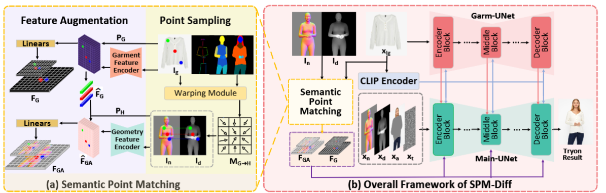

<h1>ICLR24 Incorporating Visual Correspondence into Diffusion Model for Visual Try-On</h1>
<div>
    <a>Siqi Wan</a><sup>1</sup>,
    <a>Jingwen Chen</a><sup>2</sup>,
    <a>Yingwei Pan</a><sup>2</sup>,
    <a>Ting Yao</a><sup>2</sup>,
    <a>Tao Mei</a><sup>2</sup>
</div>
<div>
    <sup>1</sup>University of Science and Technology of China; <sup>2</sup>HiDream.ai Inc
</div>
</br>

This is the official repository for the 
[Paper](*) 
"Incorporating Visual Correspondence into Diffusion Model for Visual Try-On"

## Overview

We novelly propose to explicitly capitalize
on visual correspondence as the prior to tame diffusion process instead of simply
feeding the whole garment into UNet as the appearance reference.

## Installation
Create a conda environment & Install requirments
```
conda create -n SPM-Diff python==3.9.0
conda activate SPM-Diff
cd SPM-Diff-main 
pip install -r requirements.txt
```
## Semantic Point Matching
In SPM, a set of semantic points on the garment are first sampled and matched to the
corresponding points on the target person via local flow warping. Then, these 2D cues are augmented
into 3D-aware cues with depth/normal map, which act as semantic point matching to supervise
diffusion model.

You can directly download the [Semantic Point Feature](*) or follow the instructions in [preprocessing.md](*) to extract the Semantic Point Feature yourself.


